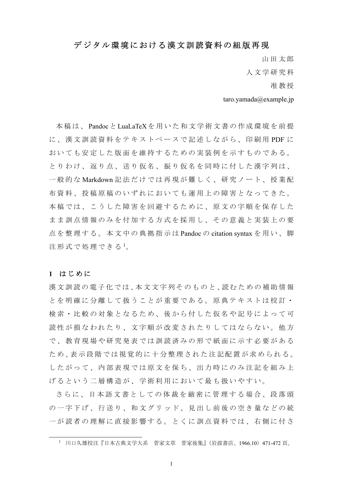

# Kanbun Parser

Languages: English | [日本語](README.ja.md) | [繁體中文（台灣）](README.zh-Hant-TW.md)

Kanbun Parser is a Ruby CLI that turns Markdown into PDF through Pandoc and LuaLaTeX, with custom support for kanbun annotation layers:

- furigana
- okurigana
- kaeriten

It is meant for two common workflows:

- full Japanese academic-style documents written in Markdown
- small kanbun-only snippets when you only want to typeset a passage

## What The Repo Contains

- `bin/jpmd` and `bin/jpmd.cmd`: CLI entrypoints for Linux and Windows
- `bin/jpmd serve`: local Sinatra web app for interactive builds
- `jpmd.yml`: project-wide layout defaults
- `examples/academic-paper.md`: full sample paper
- `examples/minimal-kanbun.md`: smallest useful kanbun-only sample
- `references/`: bundled Zotero JSON, BibTeX, and CSL samples for citation testing
- `examples/scripts/`: sample build scripts for Linux and Windows
- `filter.lua`: Pandoc filter that converts bracketed spans into kanbun TeX
- `templates/preamble.tex.erb`: layout and kanbun TeX template
- `scripts/run_visual_suite.rb`: generates `out/variation-suite/report.html`
- `docs/dependencies.md`: dependency matrix
- `docs/compile-and-adjust.md`: parameter and tuning guide
- `docs/webapp-local-builder.md`: local web app behavior and upload notes
- `docs/images/readme-final-result.png`: tracked sample render used in this README
- `AGENTS.md`: machine-oriented bootstrap document for AI agents

## Choose A Starting Example

If you already have a complete Markdown document, start from `examples/academic-paper.md`.

If you only want to compile kanbun, start from `examples/minimal-kanbun.md`. That file is intentionally small and focuses only on the kanbun syntax:

```markdown
[世]{f="よ" o="ニ"}[有]{f="あ" o="リ" k="二"}[伯]{f="はく"}[樂]{f="らく" k="一"}、[然]{f="しか" o="ル"}[後]{f="のち" o="ニ"}[有]{f="あ" o="リ" k="二"}[千]{f="せん"}[里]{f="り"}[馬]{f="ば" k="一"}。
```

## Linux Setup

These steps assume a Debian or Ubuntu style machine. The repo vendors the exact Linux font files under `vendor/fonts/`, so Linux builds do not need a Windows font directory.

### 1. Install base packages

```bash
sudo apt-get update
sudo apt-get install -y ca-certificates curl fontconfig git pandoc perl poppler-utils python3-pil ruby tar xz-utils
```

### 2. Clone the repository

```bash
git clone https://github.com/PPKan/kanbun-parser.git
cd kanbun-parser
export REPO_DIR="$(pwd)"
```

### 3. Install TeX Live 2025

The project was stabilized against TeX Live 2025.

```bash
cd /tmp
curl -L --fail -o install-tl-2025.tar.gz https://ftp.math.utah.edu/pub/tex/historic/systems/texlive/2025/tlnet-final/install-tl-unx.tar.gz
mkdir -p /tmp/install-tl-2025
tar -xzf install-tl-2025.tar.gz -C /tmp/install-tl-2025 --strip-components=1
/tmp/install-tl-2025/install-tl --profile "$REPO_DIR/docs/texlive-2025-root.profile" --repository https://ftp.math.utah.edu/pub/tex/historic/systems/texlive/2025/tlnet-final
```

### 4. Install the TeX packages used by this repo

```bash
/path/to/texlive/2025/bin/x86_64-linux/tlmgr install jlreq luatexja titlesec haranoaji lualatex-math selnolig
```

### 5. Verify

```bash
export LUALATEX_PATH=/path/to/texlive/2025/bin/x86_64-linux/lualatex
ruby -Itest test/jpmd_config_test.rb
ruby -Itest test/jpmd_compiler_test.rb
```

### 6. Build the samples

```bash
ruby bin/jpmd build examples/minimal-kanbun.md -o out/minimal-kanbun.pdf --emit-tex out/minimal-kanbun.tex
ruby bin/jpmd build examples/academic-paper.md -o out/academic-paper.pdf --emit-tex out/academic-paper.tex
```

Expected output:

```text
Wrote /path/to/kanbun-parser/out/minimal-kanbun.pdf
Wrote /path/to/kanbun-parser/out/academic-paper.pdf
```

Generated files:

- `out/minimal-kanbun.pdf`: compiled kanbun-only sample
- `out/minimal-kanbun.tex`: emitted TeX for inspection
- `out/academic-paper.pdf`: compiled full document sample
- `out/academic-paper.tex`: emitted TeX for inspection

You can also run the sample Linux script:

```bash
bash examples/scripts/build-linux.sh
```

## Local Web App

Install the Ruby web dependencies first:

```bash
bundle install
```

Then start the browser-based builder:

```bash
bundle exec ruby bin/jpmd serve --host 127.0.0.1 --port 4567
```

Open:

```text
http://127.0.0.1:4567
```

The web app can:

- build a bundled Markdown sample immediately
- accept pasted Markdown or an uploaded Markdown file
- expose the same layout and kanbun controls as `jpmd.yml`
- switch between bundled citation samples, uploaded Zotero/BibTeX files, uploaded CSL files, or the Markdown's own `bibliography:` and `csl:` metadata
- show the bundled Markdown, bibliography, and CSL files directly in readonly preview panes so users can treat them as templates

Bundled samples available in the app:

- `examples/academic-paper.md`
- `examples/minimal-kanbun.md`
- `test/fixtures/kanbun-visual.md`
- `references/zotero-export.json`
- `references/zotero-export.bib`
- `references/chicago-notes-bibliography.csl`

Reference-only custom citation samples are also kept in:

- `references/custom/`

## Windows Setup

Use PowerShell. Install these first and make sure they are on `PATH`:

- Git
- Ruby
- Pandoc
- TeX Live 2025

On Windows, the compiler expects the document fonts to be installed as real Windows fonts:

- Times New Roman
- MS Mincho

It also expects `lualatex.exe` at `C:\texlive\2025\bin\windows\lualatex.exe`, unless you override it with `LUALATEX_PATH`.

### 1. Install the required TeX packages

```powershell
C:\texlive\2025\bin\windows\tlmgr.bat install jlreq luatexja titlesec haranoaji lualatex-math selnolig
```

### 2. Clone and verify

```powershell
git clone https://github.com/PPKan/kanbun-parser.git
cd kanbun-parser
ruby -Itest test/jpmd_config_test.rb
ruby -Itest test/jpmd_compiler_test.rb
```

### 3. Build the samples

```powershell
.\bin\jpmd.cmd build .\examples\minimal-kanbun.md -o .\out\minimal-kanbun.pdf --emit-tex .\out\minimal-kanbun.tex
.\bin\jpmd.cmd build .\examples\academic-paper.md -o .\out\academic-paper.pdf --emit-tex .\out\academic-paper.tex
```

You can also run the sample Windows script:

```powershell
powershell -ExecutionPolicy Bypass -File .\examples\scripts\build-windows.ps1
```

## Visual Regression Suite

Generate the variation report with:

```bash
ruby scripts/run_visual_suite.rb
```

Expected output:

```text
Wrote /path/to/kanbun-parser/out/variation-suite/report.md
Wrote /path/to/kanbun-parser/out/variation-suite/report.html
```

Then open:

```text
out/variation-suite/report.html
```

Linux sample script:

```bash
bash examples/scripts/run-visual-suite-linux.sh
```

Windows sample script:

```powershell
powershell -ExecutionPolicy Bypass -File .\examples\scripts\run-visual-suite-windows.ps1
```

## Rendered Output

The preview below comes from the academic paper sample rendered with the current CLI setup.



## Notes

- `out/` is intentionally ignored and should be treated as generated workspace output.
- The main supported CLI commands are `build` and `serve`.
- Project defaults come from `jpmd.yml`, and document-local overrides come from `jpmd:` YAML frontmatter.
- `docs/container-bootstrap.md` is historical bring-up documentation, not the primary quick start.

## Further Reading

- `docs/dependencies.md`
- `docs/compile-and-adjust.md`
- `docs/container-bootstrap.md`
- `vendor/fonts/README.md`
