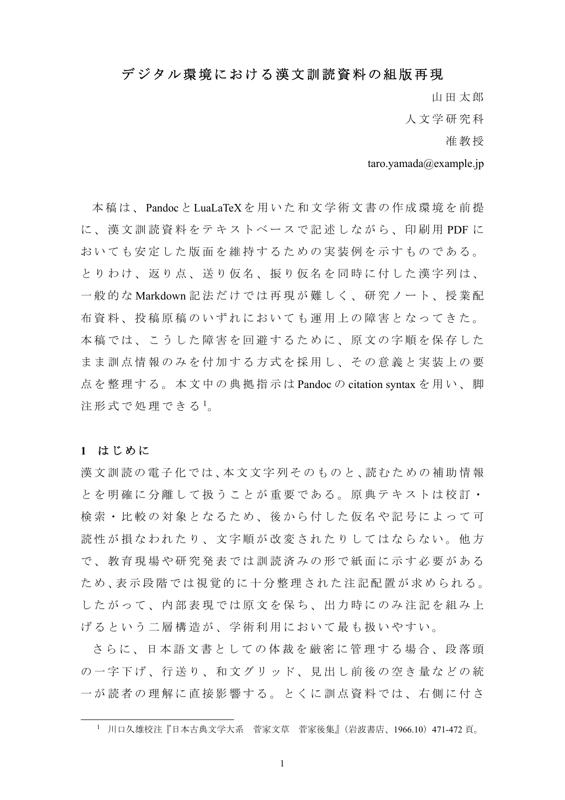

# Kanbun Parser

Languages: English | [日本語](README.ja.md) | [繁體中文（台灣）](README.zh-Hant-TW.md)

Kanbun Parser is a Ruby CLI that turns Markdown into PDF through Pandoc and LuaLaTeX, with custom support for kanbun annotation layers:

- furigana
- okurigana
- kaeriten

It is meant for three common workflows:

- full Japanese academic-style documents written in Markdown
- small kanbun-only snippets when you only want to typeset a passage

## What The Repo Contains

- `bin/jpmd` and `bin/jpmd.cmd`: CLI entrypoints for Linux and Windows
- `jpmd.yml`: project-wide layout defaults
- `examples/academic-paper.md`: full sample paper
- `examples/minimal-kanbun.md`: smallest useful kanbun-only sample
- `examples/two-file-manuscript.md`: sample manuscript with citation metadata
- `examples/scripts/`: sample build scripts for Linux and Windows
- `test/fixtures/config-default.md`: 30-character/30-line fixture with no JPMD format config
- `test/fixtures/config-inline.md`: same fixture configured with inline `jpmd:` YAML
- `test/fixtures/config-outsourced.md`: same fixture configured through `jpmd.config`
- `test/fixtures/pdf/`: tracked PDF snapshots for the three config fixtures
- `filter.lua`: Pandoc filter that converts bracketed spans into kanbun TeX
- `templates/preamble.tex.erb`: layout and kanbun TeX template
- `scripts/run_visual_suite.rb`: generates `out/variation-suite/report.html`
- `docs/dependencies.md`: dependency matrix
- `docs/compile-and-adjust.md`: parameter and tuning guide
- `docs/images/readme-final-result.png`: tracked sample render used in this README
- `AGENTS.md`: machine-oriented bootstrap document for AI agents

## Choose A Starting Example

If you already have a complete horizontal document, `examples/academic-paper.md` remains the reference sample.

If you only want to compile kanbun, start from `examples/minimal-kanbun.md`. That file is intentionally small and focuses only on the kanbun syntax:

```markdown
[世]{f="よ" o="ニ"}[有]{f="あ" o="リ" k="二"}[伯]{f="はく"}[樂]{f="らく" k="一"}、[然]{f="しか" o="ル"}[後]{f="のち" o="ニ"}[有]{f="あ" o="リ" k="二"}[千]{f="せん"}[里]{f="り"}[馬]{f="ば" k="一"}。
```

If you are new to the repo, treat those examples as starting points rather than fixed output rules. Choose the sample and then adjust CLI flags, `jpmd.yml`, or `jpmd:` frontmatter for preset, layout, kanbun spacing, and optional TeX emission.

If your manuscript needs citations, the simplest workflow is to pass the bibliography at build time:

```bash
ruby bin/jpmd build manuscript.md \
  --bibliography library.json \
  --output out/manuscript.pdf \
  --suppress-bibliography
```

Use `--render-bibliography` instead when you want the bibliography printed at the end of the PDF. You can also pass `--csl custom.csl`, but the project default is already `references/word-japanese-note.csl`.

The same metadata can still live in Markdown frontmatter when you want a self-contained manuscript. `examples/two-file-manuscript.md` shows that workflow.

Shared build settings can stay in a separate YAML file. Reference it from the document itself:

```yaml
---
jpmd:
  config: settings/academic.yml
---
```

Inline `jpmd:` values override referenced YAML, and a document with no `jpmd:` block still uses defaults.

CLI values override Markdown frontmatter for build-time choices such as output path, bibliography, CSL, preset, and bibliography rendering.

## Linux Setup

These steps assume a Debian or Ubuntu style machine. The repo vendors the exact Linux font files under `vendor/fonts/`, so Linux builds do not need a Windows font directory.

### 1. Install base packages

```bash
sudo apt-get update
sudo apt-get install -y ca-certificates curl fontconfig git pandoc perl poppler-utils python3-pil ruby tar xz-utils
```

### 2. Clone the repository

```bash
git clone https://github.com/PPKan/kanbun-parser.git
cd kanbun-parser
export REPO_DIR="$(pwd)"
```

### 3. Install TeX Live 2025

The project was stabilized against TeX Live 2025.

```bash
cd /tmp
curl -L --fail -o install-tl-2025.tar.gz https://ftp.math.utah.edu/pub/tex/historic/systems/texlive/2025/tlnet-final/install-tl-unx.tar.gz
mkdir -p /tmp/install-tl-2025
tar -xzf install-tl-2025.tar.gz -C /tmp/install-tl-2025 --strip-components=1
/tmp/install-tl-2025/install-tl --profile "$REPO_DIR/docs/texlive-2025-root.profile" --repository https://ftp.math.utah.edu/pub/tex/historic/systems/texlive/2025/tlnet-final
```

### 4. Install the TeX packages used by this repo

```bash
/path/to/texlive/2025/bin/x86_64-linux/tlmgr install jlreq luatexja titlesec haranoaji lualatex-math selnolig
```

### 5. Verify

```bash
export LUALATEX_PATH=/path/to/texlive/2025/bin/x86_64-linux/lualatex
ruby -Itest test/jpmd_config_test.rb
ruby -Itest test/jpmd_compiler_test.rb
```

### 6. Build the samples

```bash
ruby bin/jpmd build examples/minimal-kanbun.md
ruby bin/jpmd build examples/two-file-manuscript.md
```

Expected output:

```text
Wrote /path/to/kanbun-parser/out/minimal-kanbun.pdf
```

Generated files:

- `out/minimal-kanbun.pdf`: compiled kanbun-only sample
- `out/minimal-kanbun.tex`: emitted TeX for inspection
- `out/two-file-manuscript.pdf`: compiled citation-enabled manuscript sample
- `out/two-file-manuscript.tex`: emitted TeX for inspection

You can also run the sample Linux script:

```bash
bash examples/scripts/build-linux.sh
```

## Windows Setup

Use PowerShell. Install these first and make sure they are on `PATH`:

- Git
- Ruby
- Pandoc
- TeX Live 2025

On Windows, the compiler expects the document fonts to be installed as real Windows fonts:

- Times New Roman
- MS Mincho

It also expects `lualatex.exe` at `C:\texlive\2025\bin\windows\lualatex.exe`, unless you override it with `LUALATEX_PATH`.

### 1. Install the required TeX packages

```powershell
C:\texlive\2025\bin\windows\tlmgr.bat install jlreq luatexja titlesec haranoaji lualatex-math selnolig
```

### 2. Clone and verify

```powershell
git clone https://github.com/PPKan/kanbun-parser.git
cd kanbun-parser
ruby -Itest test/jpmd_config_test.rb
ruby -Itest test/jpmd_compiler_test.rb
```

### 3. Build the samples

```powershell
.\bin\jpmd.cmd build .\examples\minimal-kanbun.md
.\bin\jpmd.cmd build .\examples\two-file-manuscript.md
```

You can also run the sample Windows script:

```powershell
powershell -ExecutionPolicy Bypass -File .\examples\scripts\build-windows.ps1
```

## Config Fixture PDFs

The repo includes three 30-character/30-line fixture documents that should render the same visible PDF while exercising different configuration sources:

- `test/fixtures/config-default.md`: no JPMD format config, so project defaults apply
- `test/fixtures/config-inline.md`: inline `jpmd:` YAML
- `test/fixtures/config-outsourced.md`: external YAML through `jpmd.config`

Build them with:

```bash
ruby bin/jpmd build test/fixtures/config-default.md
ruby bin/jpmd build test/fixtures/config-inline.md
ruby bin/jpmd build test/fixtures/config-outsourced.md
```

The generated working copies land in `out/`. The tracked snapshot PDFs live in `test/fixtures/pdf/` so `out/` remains generated workspace output.

## Visual Regression Suite

Generate the variation report with:

```bash
ruby scripts/run_visual_suite.rb
```

Expected output:

```text
Wrote /path/to/kanbun-parser/out/variation-suite/report.md
Wrote /path/to/kanbun-parser/out/variation-suite/report.html
```

Then open:

```text
out/variation-suite/report.html
```

Linux sample script:

```bash
bash examples/scripts/run-visual-suite-linux.sh
```

Windows sample script:

```powershell
powershell -ExecutionPolicy Bypass -File .\examples\scripts\run-visual-suite-windows.ps1
```

## Rendered Output

The preview below comes from the academic paper sample rendered with the current CLI setup.



## Notes

- `out/` is intentionally ignored and should be treated as generated workspace output.
- The main supported CLI command is `build`.
- Project defaults come from `jpmd.yml`, document-local overrides come from `jpmd:` YAML frontmatter, and CLI flags override both for build-time choices.
- `jpmd build INPUT.md` writes to `out/<input-basename>.pdf` by default. Use `--output` for a specific PDF path and `--tex` to emit TeX for inspection.
- Citation-related CLI flags are `--bibliography`, `--csl`, `--suppress-bibliography`, and `--render-bibliography`.
- The supported document preset is `academic`.
- `docs/container-bootstrap.md` is historical bring-up documentation, not the primary quick start.

## Further Reading

- `docs/dependencies.md`
- `docs/compile-and-adjust.md`
- `docs/container-bootstrap.md`
- `vendor/fonts/README.md`
